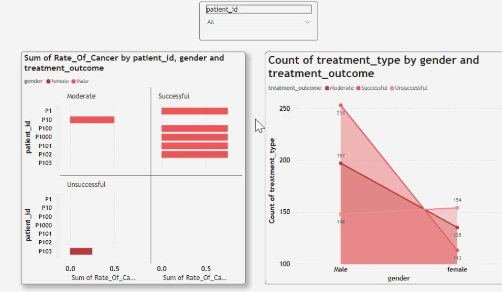
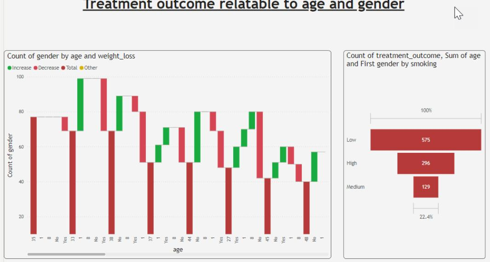

# EndToEndDataHub: Lung caner
## Purpose
- Build a data management system for lung cancer patient data.
- Use SQL database to efficiently store and manage patient information.
- Provide big data technology for future large size datasets.
- Develop Python-based models to predict the stage of cancer.
- Provide insights to assist hospitals in diagnosing cancer stages.
- Support early diagnosis and treatment planning.
## Table of content
1. [Project overview](#Project-overview)
2. [Architecture](#Architecture)
3. [Technologies Used](#Technologies-Used)
4. [Data Sources](#Data-sources)
5. [ETL Process](#ELT-process)
6. [Database Systems](#Database-systems)
7. [Optimization Techniques](#Optimization-techniques)
8. [Dashboards](#Dashboards)
9. [Setup and Installation](#Setup-and-Installation)

## Project overview
**Lung cancer** is used to predict earlier diagnoses and treatment planning that can help doctors discover the disease before becoming worth.
The project contain the following:
- **Docker-compose** file to launch the system and install all requirments needed.
- **Batch processing** using spark with juypter notebook to visualize the results.
- **ELT processing** with SSIS to transform data and keep chance for other stages to modify on transformation.
- **predctive model*** with python to benefit from the data and get project purpose.
- **Power Bi** to visualize data to stackholders with easy simplification.

## Architecture
- **SQL server** to extract data in staging layer for future use and creating data warehouse.
- **Juypter notebook** to analyze data with python using Matplotlib and Make predictions with machine learning libraries.
- **Pyspark** to add big data technology and use batch processing with it.
- **Power Bi** to create dashboards and visualize data.

## Technologies used
- **Docker** to containerize the project with eazy deploymnet.
- **SQL server** To create staging layer and data warehouse.
- **SQL Alchemy** to create engine and interact with database using python
- **Matplotlib** to analyze data and get hidden patterns.
- **Machine learning libraries** to make some predictions and use it with big data.
- **Pyspark** for batch processing and handle large datasets in the future.
- **Power Bi** to visualize to stakeholders and take decisions.

## Data sources
CSV file from data world website and another one created to handle some analyzing process.

## ELT process
1. Extraction: using sql server to extract data from csv files and insert it in staging layer.
2. Loading: Load the data into data warehouse(Star schema) for future transformation and analysis.
3. Transformation: Tranform data in suitable manner for each purpose such as analysis and prediction.
   

## Database systems
SQL server is used because it supports SSIS for ELT process and design data warehouse.


## Optimization techniques
Spark is used for it's ditributed processing and handling big data sets.

## Dashboards
 

## Setup and Installation
### Prerequisites:
- Docker installed
- Docker-compose installed

### Commands
1- Clone repo
```
https://github.com/alialkady/lungCancer.git
cd lungCancer
```
2- Initialize docker
```
docker-compose up -d
```
3- Access command line
```
docker exec -it <container_name> jupyter notebook --ip=0.0.0.0 --port=8888 --no-browser --allow-root
```
Now you are ready to start the project with all requirments
Enjoy..


